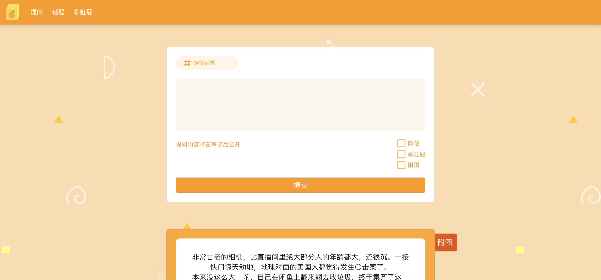

# JoiAsk 提问箱



样例可见 [轴伊Joi的提问箱](https://ask.vjoi.cn/)

## Build 构建

```bash
docker build -t joiask .
```

## Run 运行

```bash
docker run -it -d --restart always \
    -p 8080:8080 \
    -v /path/to/config.json:/work/config/config.json \
    -v /path/to/storage/:/work/frontend/public/upload-img/ \
    --name jask \
    ghcr.io/xinrea/joiask:latest
```

后台地址为: https://your.domain/admin

默认管理员账号/密码为：admin/admin

记得第一时间登录后台修改管理员密码。

## Configuration 配置

### OSS 存储图片

```json
{
    "db_type": "mysql",
    "mysql": {
        "host": "192.168.50.58",
        "port": 3306,
        "user": "root",
        "pass": "test",
        "name": "jask"
    },
    "server": {
        "host": "0.0.0.0",
        "port": 8080
    },
    "storage_type": "oss",
    "oss":{
        "address": "https://i0.vjoi.cn",
        "endpoint":"oss-cn-beijing.aliyuncs.com",
        "access_key":"",
        "secret_key":"",
        "bucket":"jwebsite-storage"
    }
}
```

### 本地存储图片

本地存储时，上传的图片将会被存储在容器的 `/work/frontend/public/upload-img/` 目录。记得要将存储目录挂在到容器的该位置下。

```json
{
    "db_type": "mysql",
    "mysql": {
        "host": "192.168.50.58",
        "port": 3306,
        "user": "root",
        "pass": "test",
        "name": "jask"
    },
    "server": {
        "host": "0.0.0.0",
        "port": 8080
    },
    "storage_type": "local"
}
```

### 使用 SQlite 数据库

同样记得将数据库文件挂载到配置文件所指定的位置，否则删除容器会导致数据丢失。

```json
{
    "db_type": "sqlite",
    "sqlite": "/work/db/jask.db",
    "server": {
    ...
}
```
